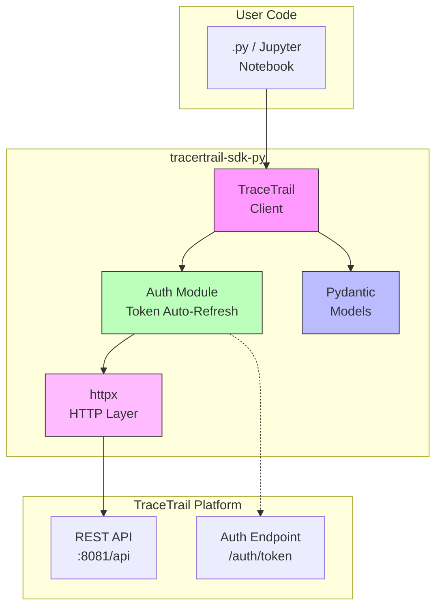
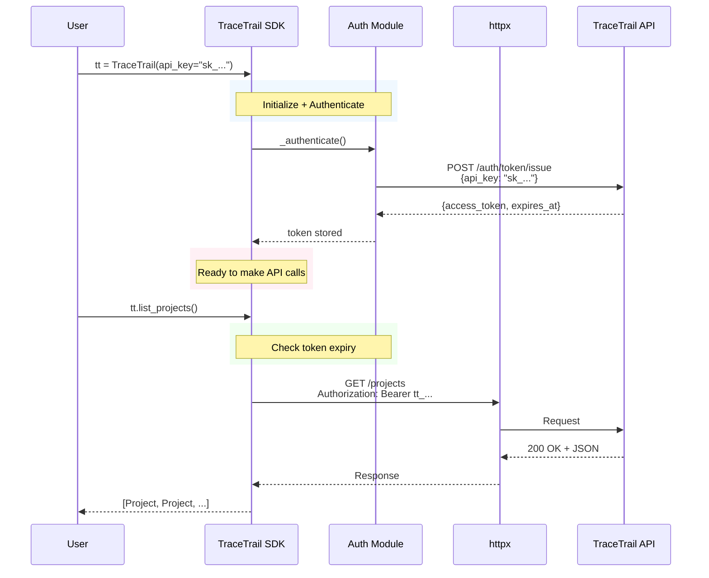

# TraceTrail Python SDK

<p align="center">
  <a href="https://pypi.org/project/tracertrail-sdk-py/">
    
  </a>
  <a href="https://pypi.org/project/tracertrail-sdk-py/">
    
  </a>
  <a href="https://github.com/tracertrail/tracertrail/actions">
    
  </a>
</p>

A Python client for interacting with the TraceTrail Data Quality Agent API.

## Architecture

### SDK Components



### Authentication Flow



## Installation

```bash
# Using pip
pip install tracertrail-sdk-py

# Using uv
uv pip install tracertrail-sdk-py
```

## Quick Start

```python
from tracertrail import TraceTrail

# Initialize with your API key
tt = TraceTrail(
    api_url="http://localhost:8081/api",
    api_key="sk_your_api_key_here"
)

# List projects
projects = tt.list_projects()
print(projects)

# Create an issue
issue = tt.create_issue(
    title="Data Quality Alert",
    description="Found null values in email column",
    severity="high",
    data_source_id="src_001"
)
print(issue)
```

## Authentication

The SDK supports automatic token management:

```python
# Initialize - SDK automatically exchanges API key for access token
tt = TraceTrail(
    api_url="http://localhost:8081/api",
    api_key="sk_...",
    auto_refresh=True,    # Automatically refresh token before expiry
    refresh_buffer=300,    # Refresh 5 minutes before expiry
)

# Or use a pre-obtained access token
tt = TraceTrail(
    api_url="http://localhost:8081/api",
    access_token="tt_your_token_here"
)
```

## API Examples

### Working with Projects

```python
# List all projects
projects = tt.list_projects()

# Filter projects
projects = tt.list_projects(status="active", limit=10)

# Get single project
project = tt.get_project("proj_123")

# Create a new project
project = tt.create_project(
    name="Customer Analytics",
    description="Customer data analysis pipeline"
)

# Update project
tt.update_project(project["id"], status="active")

# Delete project
tt.delete_project(project["id"])
```

### Working with Issues

```python
# List issues with filters
issues = tt.list_issues(status="open", severity="critical")

# Create an issue
issue = tt.create_issue(
    title="Duplicate records detected",
    description="Found 500 duplicate customer IDs",
    severity="high",
    data_source_id="src_crm_001"
)

# Update issue
tt.update_issue(issue["id"], status="in_progress")

# Resolve issue
tt.resolve_issue(issue["id"], "Fixed by adding deduplication step")

# Delete issue
tt.delete_issue(issue["id"])
```

### Logging Processing Runs

```python
# Start a processing run
run = tt.start_processing_run(
    data_source_id="src_sales_001",
    metadata={"batch_id": "batch_123"}
)

# ... do processing ...

# Complete the run
tt.complete_processing_run(
    run_id=run["id"],
    status="completed",
    records_processed=10000,
    records_failed=5
)
```

### Using MCP Tools

```python
# List available MCP tools
tools = tt.list_mcp_tools()

# Call a specific tool
result = tt.call_mcp_tool("system_health")
```

### Managing API Keys

```python
# List your API keys
keys = tt.list_api_keys()

# Create a new API key
new_key = tt.create_api_key(
    name="Jupyter Notebook",
    expires_in=2592000,  # 30 days in seconds
    rate_limit=100
)
print(new_key["api_key"])  # Save this - only shown once!

# Delete an API key
tt.delete_api_key(key_id)
```

## Configuration

| Parameter | Type | Default | Description |
|-----------|------|---------|-------------|
| `api_url` | str | `http://localhost:8081/api` | Base URL of TraceTrail API |
| `api_key` | str | `None` | API key for authentication |
| `access_token` | str | `None` | Pre-obtained access token |
| `timeout` | float | `30.0` | Request timeout in seconds |
| `auto_refresh` | bool | `True` | Automatically refresh token |
| `refresh_buffer` | int | `300` | Seconds before expiry to refresh |

## Error Handling

```python
from tracertrail import TraceTrail
from tracertrail.exceptions import (
    AuthenticationError,
    NotFoundError,
    ValidationError,
    RateLimitError,
    ServerError,
)

try:
    project = tt.get_project("proj_123")
except NotFoundError as e:
    print(f"Project not found: {e}")
except ValidationError as e:
    print(f"Invalid request: {e}")
except RateLimitError as e:
    print(f"Rate limited. Retry after: {e.retry_after}s")
except ServerError as e:
    print(f"Server error: {e}")
```

## Development

### Setup

```bash
# Clone the repository
git clone https://github.com/tracertrail/tracertrail.git
cd tracertrail/tracertrail-sdk

# Install in development mode
uv pip install -e ".[dev]"

# Run tests
pytest

# Run tests with coverage
pytest --cov=tracertrail --cov-report=html
```

### Project Structure

```
tracertrail-sdk/
├── pyproject.toml           # UV + pytest config
├── README.md                # This file
├── tests/
│   ├── test_client.py      # Client tests
│   ├── test_integration.py  # Live API tests
│   └── test_http.py        # HTTP layer tests
└── tracertrail/
    ├── __init__.py          # Package exports
    ├── client.py           # Main TraceTrail class
    ├── auth.py              # Authentication + auto-refresh
    ├── config.py            # Configuration
    ├── exceptions.py       # Custom exceptions
    ├── http.py              # httpx wrapper
    └── models/
        ├── __init__.py      # All Pydantic models
        └── base.py          # Base model class
```

## License

MIT License - see LICENSE file for details.

## Support

- Documentation: https://tracertrail.io/docs
- API Reference: http://localhost:8081/api/docs
- Issues: https://github.com/tracertrail/tracertrail/issues
